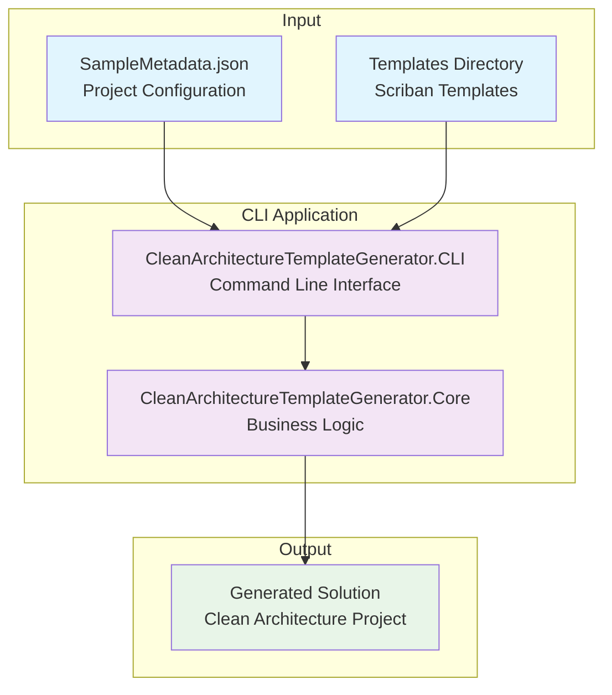

# Project Overview

## What is Clean Architecture Template Generator?

The Clean Architecture Template Generator is a .NET CLI tool that automatically generates complete Clean Architecture projects based on JSON metadata configuration. It uses the Scriban templating engine to create a full project structure with entities, commands, queries, repositories, and controllers.

## High-Level Architecture

## Key Components

### 1. CLI Application
- **Purpose**: Entry point for the application
- **Technology**: System.CommandLine for modern CLI parsing
- **Responsibilities**: 
  - Parse command-line arguments
  - Validate input parameters
  - Initialize the core generation engine

### 2. Core Engine
- **Purpose**: Main business logic for code generation
- **Technology**: .NET 8, Newtonsoft.Json, Scriban
- **Responsibilities**:
  - Parse JSON metadata
  - Process templates
  - Generate project structure
  - Create output files

### 3. Template System
- **Purpose**: Define the structure and content of generated code
- **Technology**: Scriban templating engine
- **Responsibilities**:
  - Define code templates for each layer
  - Support dynamic content generation
  - Enable customization through metadata

## Generated Architecture Patterns

The tool generates projects following these architectural patterns:

### Clean Architecture Layers
1. **Domain Layer** - Core business logic and entities
2. **Application Layer** - Use cases and application services
3. **Infrastructure Layer** - Data access and external services
4. **Presentation Layer** - API controllers and user interfaces

### Design Patterns
- **CQRS (Command Query Responsibility Segregation)**
- **Repository Pattern**
- **Mediator Pattern**
- **Dependency Inversion Principle**

## Benefits

### For Developers
- ⚡ **Rapid Development**: Skip boilerplate code setup
- 🏗️ **Consistent Architecture**: Enforced Clean Architecture principles
- 📚 **Learning Tool**: Demonstrates best practices
- 🔧 **Customizable**: Flexible through JSON configuration

### For Teams
- 🎯 **Standardization**: Consistent project structure across team
- 📋 **Best Practices**: Built-in architectural patterns
- 🚀 **Productivity**: Faster project initialization
- 🔄 **Maintainability**: Well-structured, testable code

## Use Cases

1. **New Project Setup**: Quickly scaffold new Clean Architecture projects
2. **Learning Clean Architecture**: Understand proper layer separation
3. **Team Onboarding**: Provide consistent starting point for new developers
4. **Prototyping**: Rapidly create project structure for proof of concepts
5. **Microservices**: Generate multiple small services with consistent structure

## Technology Stack

- **.NET 8.0**: Latest .NET framework
- **System.CommandLine**: Modern CLI parsing
- **Newtonsoft.Json**: JSON serialization/deserialization
- **Scriban**: Powerful templating engine
- **C# 12**: Latest language features

## Next Steps

- [Getting Started Guide](./02-getting-started.md) - Learn how to use the tool
- [Architecture Deep Dive](./03-architecture.md) - Detailed technical architecture
- [Configuration Guide](./04-configuration.md) - JSON metadata configuration
