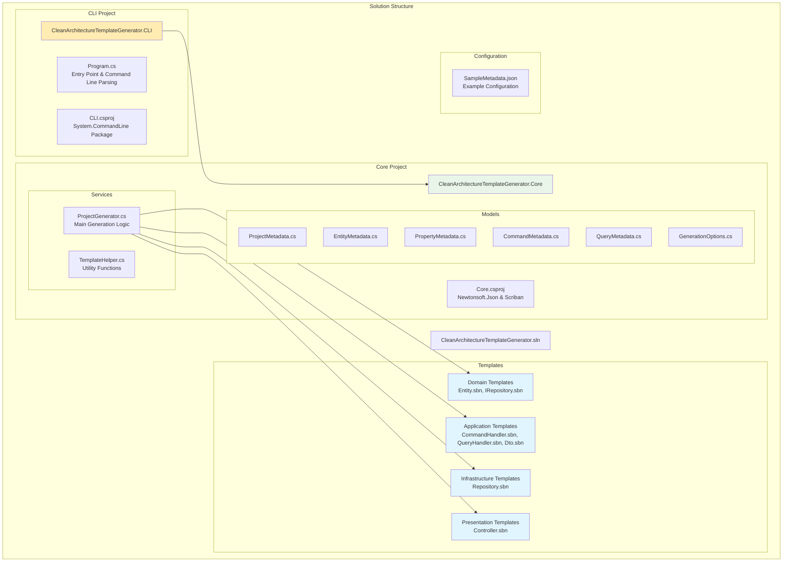
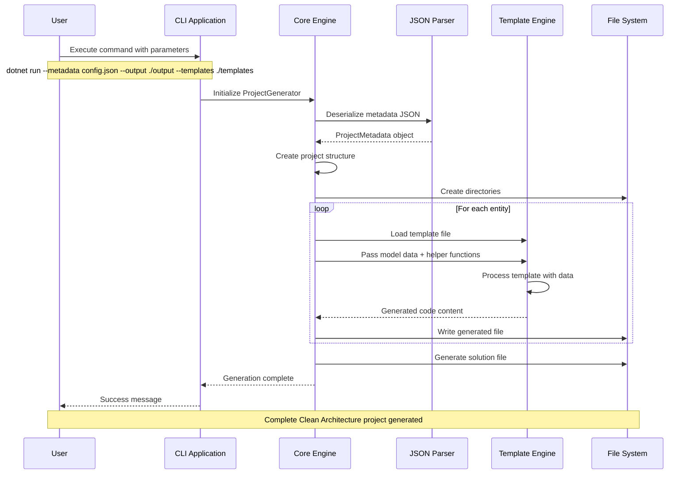
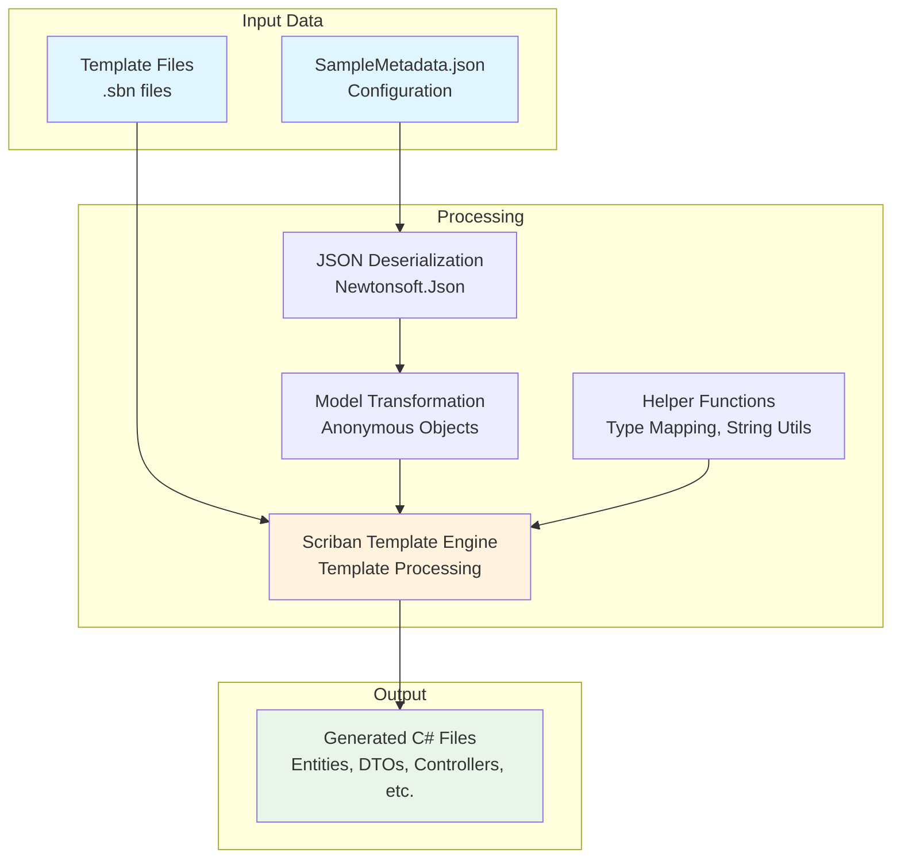

# Architecture Deep Dive

## Solution Structure

The Clean Architecture Template Generator follows a modular architecture with clear separation of concerns.



## Data Model Architecture

The core data models represent the metadata structure used for code generation:

```mermaid
classDiagram
    class ProjectMetadata {
        +string ProjectName
        +List~EntityMetadata~ Entities
        +GenerationOptions Options
    }
    
    class EntityMetadata {
        +string Name
        +List~PropertyMetadata~ Properties
        +List~CommandMetadata~ Commands
        +List~QueryMetadata~ Queries
    }
    
    class PropertyMetadata {
        +string Name
        +string Type
        +bool IsKey
        +bool Required
    }
    
    class CommandMetadata {
        +string Name
        +string Type
        +string ResultType
    }
    
    class QueryMetadata {
        +string Name
        +string Type
        +string ResultType
    }
    
    class GenerationOptions {
        +bool UseFluentValidation
        +bool UseAutoMapper
        +bool UseMediatR
        +string Database
        +string Authentication
    }
    
    ProjectMetadata ||--o{ EntityMetadata : contains
    ProjectMetadata ||--|| GenerationOptions : has
    EntityMetadata ||--o{ PropertyMetadata : has
    EntityMetadata ||--o{ CommandMetadata : has
    EntityMetadata ||--o{ QueryMetadata : has
    
    note for ProjectMetadata "Root configuration object\nDeserialized from JSON"
    note for EntityMetadata "Represents a domain entity\nwith its operations"
    note for PropertyMetadata "Entity property definition\nwith type and constraints"
```

## Core Components

### 1. CLI Application Layer

**Purpose**: Provides the command-line interface for the tool.

**Key Classes**:
- `Program.cs`: Entry point with System.CommandLine configuration

**Responsibilities**:
- Parse command-line arguments
- Validate input parameters
- Initialize and execute the core generation engine
- Handle errors and provide user feedback

### 2. Core Business Logic

**Purpose**: Contains the main generation logic and data models.

**Key Classes**:
- `ProjectGenerator`: Main orchestrator for code generation
- `TemplateHelper`: Utility functions for template processing
- Model classes: Data structures for metadata

**Responsibilities**:
- Parse and validate JSON metadata
- Orchestrate the generation process
- Process templates with Scriban
- Create output directory structure
- Generate all code files

### 3. Template System

**Purpose**: Defines the structure and content of generated code.

**Template Categories**:
- **Domain**: Entities, repository interfaces
- **Application**: Commands, queries, DTOs, handlers
- **Infrastructure**: Repository implementations
- **Presentation**: API controllers

## Generation Process Flow



## Template Engine Architecture



## Key Design Decisions

### 1. Separation of Concerns
- **CLI layer**: Only handles user interaction and command parsing
- **Core layer**: Contains all business logic and generation algorithms
- **Templates**: Separate from code, allowing easy customization

### 2. Metadata-Driven Approach
- **JSON configuration**: Human-readable and version-controllable
- **Flexible schema**: Supports various entity types and operations
- **Extensible options**: Easy to add new generation features

### 3. Template Engine Choice (Scriban)
- **Performance**: Fast template processing
- **Features**: Rich templating language with loops, conditionals
- **Safety**: Secure template execution
- **Extensibility**: Custom function registration

### 4. Clean Architecture Compliance
- **Dependency Direction**: Dependencies point inward
- **Layer Isolation**: Each layer has specific responsibilities
- **Testability**: Loose coupling enables easy unit testing

## Error Handling Strategy

### 1. Input Validation
- Command-line parameter validation
- JSON schema validation
- File existence checks

### 2. Generation Errors
- Template parsing errors
- File system access errors
- Model transformation errors

### 3. User Feedback
- Clear error messages
- Progress indicators
- Success confirmations

## Performance Considerations

### 1. Template Caching
- Templates are loaded once per generation
- Compiled templates for better performance

### 2. Async Operations
- File I/O operations are asynchronous
- Parallel processing where possible

### 3. Memory Management
- Efficient object creation
- Proper disposal of resources

## Extensibility Points

### 1. New Templates
- Add new `.sbn` files to templates directory
- Register in `ProjectGenerator` class

### 2. Custom Helper Functions
- Add to `TemplateHelper` class
- Register in Scriban context

### 3. New Metadata Properties
- Extend model classes
- Update JSON schema
- Modify templates accordingly

## Next Steps

- [Configuration Guide](./04-configuration.md) - Learn about JSON metadata
- [Template System](./05-template-system.md) - Deep dive into templating
- [Extending Templates](./10-extending-templates.md) - Create custom templates
