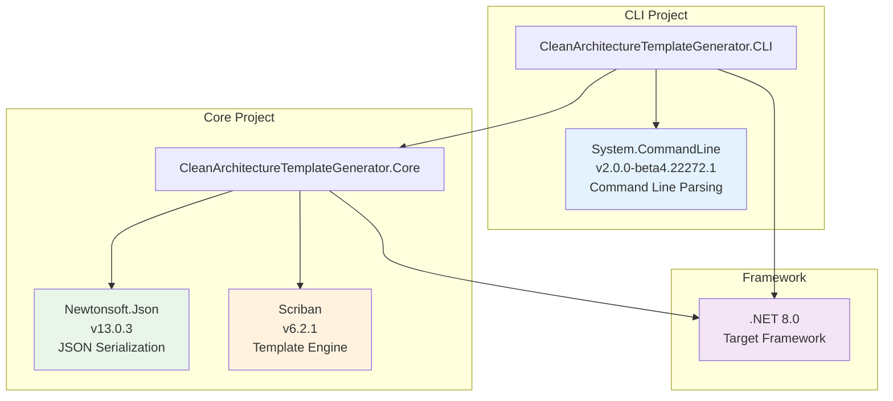

# Package Dependencies

## Overview

The Clean Architecture Template Generator uses carefully selected NuGet packages to provide modern, efficient, and reliable functionality. This document details all dependencies and their purposes.

## Dependency Architecture



## CLI Project Dependencies

### System.CommandLine (v2.0.0-beta4.22272.1)

**Purpose**: Modern command-line parsing library for .NET applications.

**Why This Package**:
- ✅ **Modern API**: Clean, fluent API for defining commands and options
- ✅ **Rich Features**: Built-in help generation, validation, and error handling
- ✅ **Type Safety**: Strong typing for command-line arguments
- ✅ **Microsoft Official**: Developed and maintained by Microsoft

**Key Features Used**:
- Option definition with aliases (`--metadata`, `-m`)
- Required parameter validation
- Automatic help generation
- Async command handlers

**Usage Example**:
```csharp
var metadataOption = new Option<string>(
    "--metadata",
    "Path to metadata JSON file")
{
    IsRequired = true
};
metadataOption.AddAlias("-m");

var rootCommand = new RootCommand("Clean Architecture Project Generator");
rootCommand.AddOption(metadataOption);
```

**Alternatives Considered**:
- `CommandLineParser`: More mature but less modern API
- `McMaster.Extensions.CommandLineUtils`: Good alternative but less Microsoft integration
- Custom parsing: Too much boilerplate code

## Core Project Dependencies

### Newtonsoft.Json (v13.0.3)

**Purpose**: High-performance JSON serialization and deserialization library.

**Why This Package**:
- ✅ **Mature and Stable**: Battle-tested in production environments
- ✅ **Rich Features**: Extensive customization options
- ✅ **Attribute Support**: Easy property mapping with `[JsonProperty]`
- ✅ **Error Handling**: Comprehensive error reporting
- ✅ **Performance**: Optimized for speed and memory usage

**Key Features Used**:
- JSON deserialization of metadata files
- Property name mapping (camelCase ↔ PascalCase)
- Custom serialization attributes
- Error handling for malformed JSON

**Usage Example**:
```csharp
[JsonProperty("projectName")]
public string ProjectName { get; set; } = string.Empty;

var metadata = JsonConvert.DeserializeObject<ProjectMetadata>(json);
```

**Alternatives Considered**:
- `System.Text.Json`: Newer but less feature-rich for complex scenarios
- `YamlDotNet`: YAML support not required for this use case

### Scriban (v6.2.1)

**Purpose**: Fast, powerful, and safe templating engine for .NET.

**Why This Package**:
- ✅ **Performance**: One of the fastest templating engines for .NET
- ✅ **Security**: Safe template execution with sandboxing
- ✅ **Rich Syntax**: Liquid-like syntax with advanced features
- ✅ **Extensibility**: Easy to add custom functions and filters
- ✅ **Active Development**: Regular updates and improvements

**Key Features Used**:
- Template parsing and compilation
- Variable substitution
- Loops and conditionals
- Custom function registration
- Safe template execution

**Usage Example**:
```csharp
var template = Template.Parse(templateContent);
var scriptObject = new ScriptObject();
scriptObject.Import(model);
scriptObject.Import("map_csharp_type", new Func<string, string>(TemplateHelper.MapCSharpType));

var context = new TemplateContext();
context.PushGlobal(scriptObject);
var result = await template.RenderAsync(context);
```

**Alternatives Considered**:
- `RazorEngine`: More complex setup, security concerns
- `Handlebars.Net`: Less feature-rich
- `T4 Templates`: Compile-time only, not suitable for runtime generation

## Framework Dependencies

### .NET 8.0

**Purpose**: Target framework providing the runtime and base class libraries.

**Why This Version**:
- ✅ **Latest LTS**: Long-term support with latest features
- ✅ **Performance**: Significant performance improvements
- ✅ **Modern C#**: Support for C# 12 features
- ✅ **Cross-Platform**: Runs on Windows, macOS, and Linux

**Key Features Used**:
- Modern C# syntax (pattern matching, records, etc.)
- Async/await patterns
- File I/O operations
- LINQ operations
- Generic collections

## Implicit Dependencies

These packages are included automatically with .NET 8.0:

### System.IO
- File and directory operations
- Path manipulation
- Async file I/O

### System.Linq
- Collection filtering and transformation
- Query operations on metadata

### System.Text
- String manipulation
- Encoding operations

### System.Threading.Tasks
- Async/await support
- Task-based operations

## Development Dependencies

### Microsoft.NET.Sdk
- Project compilation
- NuGet package management
- Build targets

## Package Selection Criteria

When selecting packages, we considered:

### 1. **Stability and Maturity**
- Established packages with proven track records
- Regular maintenance and updates
- Large user base and community support

### 2. **Performance**
- Minimal overhead
- Efficient memory usage
- Fast execution times

### 3. **Security**
- No known vulnerabilities
- Safe execution models
- Trusted publishers

### 4. **Maintainability**
- Clear documentation
- Active development
- Backward compatibility

### 5. **Integration**
- Works well with .NET ecosystem
- Compatible with other packages
- Minimal conflicts

## Version Management

### Versioning Strategy
- **Major versions**: Only when breaking changes are necessary
- **Minor versions**: New features and improvements
- **Patch versions**: Bug fixes and security updates

### Update Policy
- Regular security updates
- Quarterly dependency reviews
- Testing before version bumps

## Security Considerations

### Package Security
- All packages are from trusted publishers
- Regular security scanning
- No packages with known vulnerabilities

### Template Security
- Scriban provides sandboxed execution
- No access to system resources from templates
- Input validation for all user data

## Performance Impact

### Package Overhead
- **System.CommandLine**: Minimal startup overhead
- **Newtonsoft.Json**: Fast JSON processing
- **Scriban**: Optimized template compilation and execution

### Memory Usage
- Efficient object creation
- Proper disposal patterns
- Minimal memory leaks

## Future Considerations

### Potential Upgrades
- **System.Text.Json**: Consider migration when feature parity is achieved
- **System.CommandLine**: Upgrade to stable version when available
- **.NET 9+**: Upgrade to newer framework versions as they become LTS

### New Dependencies
- **FluentValidation**: For enhanced input validation
- **Serilog**: For structured logging
- **Polly**: For resilience patterns

## Troubleshooting

### Common Issues
1. **Package restore failures**: Check network connectivity and NuGet sources
2. **Version conflicts**: Use `dotnet list package --outdated` to check versions
3. **Missing packages**: Run `dotnet restore` to restore packages

### Resolution Steps
1. Clear NuGet cache: `dotnet nuget locals all --clear`
2. Restore packages: `dotnet restore`
3. Rebuild solution: `dotnet build --no-restore`

## Next Steps

- [Generated Structure](./07-generated-structure.md) - See what the tool creates
- [Code Examples](./08-code-examples.md) - View generated code samples
- [Troubleshooting](./11-troubleshooting.md) - Common issues and solutions
