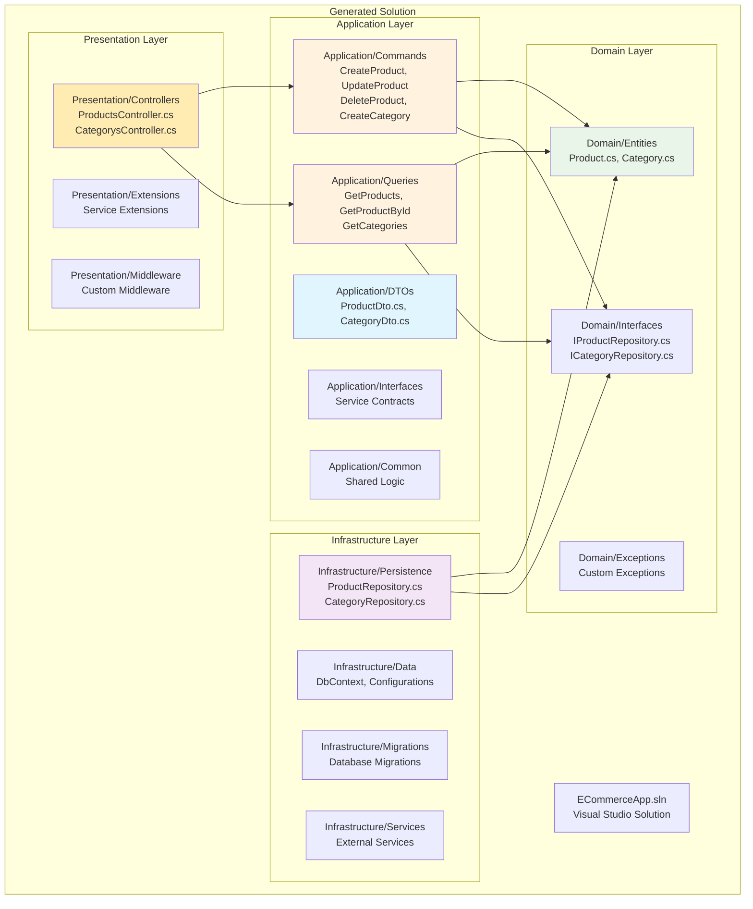

# Generated Project Structure

## Overview

The Clean Architecture Template Generator creates a complete .NET solution following Clean Architecture principles with proper layer separation and dependency management.

## Complete Directory Structure

```
ECommerceApp/                          # Root directory
├── ECommerceApp.sln                   # Visual Studio Solution file
└── ECommerceApp/                      # Main project directory
    ├── Domain/                        # Domain Layer (Core Business Logic)
    │   ├── Entities/                  # Domain Entities
    │   │   ├── Product.cs
    │   │   ├── Category.cs
    │   │   └── ...
    │   ├── Interfaces/                # Repository Contracts
    │   │   ├── IProductRepository.cs
    │   │   ├── ICategoryRepository.cs
    │   │   └── ...
    │   └── Exceptions/                # Domain Exceptions (placeholder)
    ├── Application/                   # Application Layer (Use Cases)
    │   ├── Commands/                  # Write Operations (CQRS)
    │   │   ├── Products/
    │   │   │   ├── CreateProductCommand.cs
    │   │   │   ├── UpdateProductCommand.cs
    │   │   │   └── DeleteProductCommand.cs
    │   │   └── Categories/
    │   │       ├── CreateCategoryCommand.cs
    │   │       └── ...
    │   ├── Queries/                   # Read Operations (CQRS)
    │   │   ├── Products/
    │   │   │   ├── GetProductsQuery.cs
    │   │   │   └── GetProductByIdQuery.cs
    │   │   └── Categories/
    │   │       └── GetCategoriesQuery.cs
    │   ├── DTOs/                      # Data Transfer Objects
    │   │   ├── ProductDto.cs
    │   │   ├── CategoryDto.cs
    │   │   └── ...
    │   ├── Interfaces/                # Application Service Contracts (placeholder)
    │   └── Common/                    # Shared Application Logic (placeholder)
    ├── Infrastructure/                # Infrastructure Layer (External Concerns)
    │   ├── Persistence/               # Data Access Implementations
    │   │   ├── ProductRepository.cs
    │   │   ├── CategoryRepository.cs
    │   │   └── ...
    │   ├── Data/                      # Database Context (placeholder)
    │   ├── Migrations/                # Database Migrations (placeholder)
    │   └── Services/                  # External Services (placeholder)
    └── Presentation/                  # Presentation Layer (API/UI)
        ├── Controllers/               # API Controllers
        │   ├── ProductsController.cs
        │   ├── CategorysController.cs
        │   └── ...
        ├── Extensions/                # Service Extensions (placeholder)
        └── Middleware/                # Custom Middleware (placeholder)
```

## Clean Architecture Layers



## Layer Details

### 1. Domain Layer (Core)

**Purpose**: Contains the core business logic and domain entities.

**Generated Files**:
- **Entities**: Rich domain models with encapsulated business logic
- **Repository Interfaces**: Contracts for data access (Dependency Inversion)
- **Exceptions**: Placeholder for domain-specific exceptions

**Characteristics**:
- ✅ No dependencies on other layers
- ✅ Contains business rules and logic
- ✅ Immutable where appropriate
- ✅ Rich domain models

### 2. Application Layer (Use Cases)

**Purpose**: Orchestrates domain objects to fulfill use cases.

**Generated Files**:
- **Commands**: Write operations following CQRS pattern
- **Queries**: Read operations following CQRS pattern
- **DTOs**: Data contracts for API communication
- **Handlers**: MediatR handlers for commands and queries

**Characteristics**:
- ✅ Depends only on Domain layer
- ✅ Contains application-specific business rules
- ✅ Coordinates domain objects
- ✅ Defines interfaces for infrastructure

### 3. Infrastructure Layer (External Concerns)

**Purpose**: Implements interfaces defined in inner layers.

**Generated Files**:
- **Repository Implementations**: Concrete data access implementations
- **Database Context**: Entity Framework configurations (placeholder)
- **External Services**: Third-party service integrations (placeholder)

**Characteristics**:
- ✅ Implements domain and application interfaces
- ✅ Contains framework-specific code
- ✅ Handles external dependencies
- ✅ Database access and external APIs

### 4. Presentation Layer (API/UI)

**Purpose**: Handles user interaction and external communication.

**Generated Files**:
- **API Controllers**: RESTful endpoints
- **Middleware**: Cross-cutting concerns (placeholder)
- **Extensions**: Service registration helpers (placeholder)

**Characteristics**:
- ✅ Depends on Application layer
- ✅ Handles HTTP requests/responses
- ✅ Input validation and formatting
- ✅ Authentication and authorization

## File Generation Patterns

### Per Entity Generation

For each entity defined in the metadata, the generator creates:

| Layer | Files Generated | Pattern |
|-------|----------------|---------|
| **Domain** | Entity class | `{EntityName}.cs` |
| **Domain** | Repository interface | `I{EntityName}Repository.cs` |
| **Application** | DTO class | `{EntityName}Dto.cs` |
| **Application** | Command handlers | `{CommandName}Command.cs` |
| **Application** | Query handlers | `{QueryName}Query.cs` |
| **Infrastructure** | Repository implementation | `{EntityName}Repository.cs` |
| **Presentation** | API controller | `{EntityName}sController.cs` |

### Command Generation

For each command in entity metadata:

```
Application/Commands/{EntityName}s/{CommandName}Command.cs
```

Examples:
- `Application/Commands/Products/CreateProductCommand.cs`
- `Application/Commands/Products/UpdateProductCommand.cs`
- `Application/Commands/Products/DeleteProductCommand.cs`

### Query Generation

For each query in entity metadata:

```
Application/Queries/{EntityName}s/{QueryName}Query.cs
```

Examples:
- `Application/Queries/Products/GetProductsQuery.cs`
- `Application/Queries/Products/GetProductByIdQuery.cs`

## Placeholder Directories

Some directories are created as placeholders for future development:

### Domain Layer
- `Domain/Exceptions/` - Custom domain exceptions
- `Domain/ValueObjects/` - Value objects (future)
- `Domain/Services/` - Domain services (future)

### Application Layer
- `Application/Interfaces/` - Application service contracts
- `Application/Common/` - Shared application logic
- `Application/Behaviors/` - MediatR behaviors (future)

### Infrastructure Layer
- `Infrastructure/Data/` - Database context and configurations
- `Infrastructure/Migrations/` - Entity Framework migrations
- `Infrastructure/Services/` - External service implementations

### Presentation Layer
- `Presentation/Extensions/` - Service registration extensions
- `Presentation/Middleware/` - Custom middleware
- `Presentation/Filters/` - Action filters (future)

## Solution File Structure

The generated `.sln` file includes:

```xml
Microsoft Visual Studio Solution File, Format Version 12.00
# Visual Studio Version 17
VisualStudioVersion = 17.0.31903.59
MinimumVisualStudioVersion = 10.0.40219.1
Project("{FAE04EC0-301F-11D3-BF4B-00C04F79EFBC}") = "ECommerceApp", "ECommerceApp\ECommerceApp.csproj", "{GUID}"
EndProject
Global
    GlobalSection(SolutionConfigurationPlatforms) = preSolution
        Debug|Any CPU = Debug|Any CPU
        Release|Any CPU = Release|Any CPU
    EndGlobalSection
    GlobalSection(ProjectConfigurationPlatforms) = postSolution
        {GUID}.Debug|Any CPU.ActiveCfg = Debug|Any CPU
        {GUID}.Debug|Any CPU.Build.0 = Debug|Any CPU
        {GUID}.Release|Any CPU.ActiveCfg = Release|Any CPU
        {GUID}.Release|Any CPU.Build.0 = Release|Any CPU
    EndGlobalSection
EndGlobal
```

## Naming Conventions

### Files and Directories
- **PascalCase** for all file and directory names
- **Plural** for controller names (`ProductsController`)
- **Singular** for entity names (`Product`)
- **Descriptive** command and query names (`CreateProductCommand`)

### Namespaces
- Root namespace: `{ProjectName}`
- Layer namespaces: `{ProjectName}.{Layer}`
- Feature namespaces: `{ProjectName}.{Layer}.{Feature}`

Examples:
- `ECommerceApp.Domain.Entities`
- `ECommerceApp.Application.Commands.Products`
- `ECommerceApp.Infrastructure.Persistence`

## Customization Points

### Adding New Layers
1. Create new template directory
2. Add templates for the layer
3. Update `ProjectGenerator.cs` to process new templates

### Modifying Structure
1. Update template organization
2. Modify directory creation logic
3. Update namespace patterns

### Adding New File Types
1. Create new template files
2. Add generation logic to `ProjectGenerator.cs`
3. Update metadata schema if needed

## Best Practices

### Directory Organization
- Keep related files together
- Use consistent naming patterns
- Separate concerns clearly
- Maintain layer boundaries

### File Naming
- Use descriptive names
- Follow .NET conventions
- Be consistent across the project
- Include layer context in names

## Next Steps

- [Code Examples](./08-code-examples.md) - See generated code samples
- [API Reference](./09-api-reference.md) - Core classes and methods
- [Extending Templates](./10-extending-templates.md) - Customize the output
