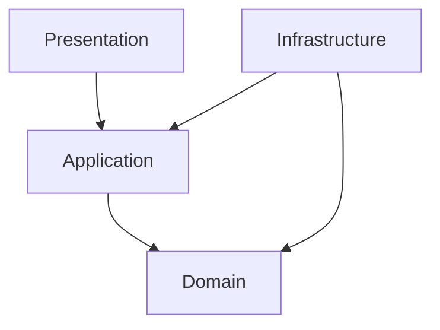

# Best Practices

## Overview

This guide provides recommended practices for using the Clean Architecture Template Generator effectively, maintaining code quality, and ensuring long-term maintainability.

## Configuration Best Practices

### 1. JSON Metadata Design

#### Use Descriptive Names
```json
// Good
{
  "name": "ProductCatalogItem",
  "properties": [
    { "name": "ProductIdentifier", "type": "Guid", "isKey": true },
    { "name": "DisplayName", "type": "string", "required": true }
  ]
}

// Avoid
{
  "name": "Item",
  "properties": [
    { "name": "Id", "type": "Guid", "isKey": true },
    { "name": "Name", "type": "string", "required": true }
  ]
}
```

#### Follow Consistent Naming Conventions
- **Entities**: PascalCase, singular nouns (`Product`, `Customer`, `OrderItem`)
- **Properties**: PascalCase, descriptive (`FirstName`, `CreatedAt`, `IsActive`)
- **Commands**: PascalCase, action verbs (`CreateProduct`, `UpdateCustomer`, `DeleteOrder`)
- **Queries**: PascalCase, descriptive (`GetActiveProducts`, `FindCustomerByEmail`)

#### Structure Properties Logically
```json
{
  "properties": [
    // Identity properties first
    { "name": "Id", "type": "Guid", "isKey": true },
    
    // Required business properties
    { "name": "Name", "type": "string", "required": true },
    { "name": "Price", "type": "decimal", "required": true },
    
    // Optional business properties
    { "name": "Description", "type": "string" },
    { "name": "Category", "type": "string" },
    
    // Foreign keys
    { "name": "CategoryId", "type": "Guid" },
    
    // Audit properties
    { "name": "CreatedAt", "type": "DateTime", "required": true },
    { "name": "UpdatedAt", "type": "DateTime" }
  ]
}
```

### 2. Entity Design Principles

#### Single Responsibility
Each entity should represent a single business concept:

```json
// Good - focused entity
{
  "name": "Product",
  "properties": [
    { "name": "Id", "type": "Guid", "isKey": true },
    { "name": "Name", "type": "string", "required": true },
    { "name": "Price", "type": "decimal", "required": true },
    { "name": "Description", "type": "string" }
  ]
}

// Avoid - mixed responsibilities
{
  "name": "ProductWithOrderInfo",
  "properties": [
    { "name": "ProductId", "type": "Guid", "isKey": true },
    { "name": "ProductName", "type": "string", "required": true },
    { "name": "LastOrderDate", "type": "DateTime" },
    { "name": "CustomerName", "type": "string" }
  ]
}
```

#### Proper Key Design
```json
{
  "properties": [
    // Always have a primary key
    { "name": "Id", "type": "Guid", "isKey": true },
    
    // Mark only one property as key
    // Use Guid for distributed systems
    // Use int for simple scenarios
  ]
}
```

### 3. Command and Query Design

#### Command Naming
```json
{
  "commands": [
    // Use action verbs
    { "name": "CreateProduct", "type": "create" },
    { "name": "UpdateProductPrice", "type": "update" },
    { "name": "ActivateProduct", "type": "update" },
    { "name": "DeleteProduct", "type": "delete" }
  ]
}
```

#### Query Naming
```json
{
  "queries": [
    // Use descriptive names
    { "name": "GetActiveProducts", "type": "list", "resultType": "List<ProductDto>" },
    { "name": "GetProductById", "type": "single", "resultType": "ProductDto" },
    { "name": "SearchProductsByName", "type": "list", "resultType": "List<ProductDto>" }
  ]
}
```

## Template Development Best Practices

### 1. Template Organization

#### Logical Structure
```
templates/
├── Domain/
│   ├── Entities/           # Core business entities
│   ├── ValueObjects/       # Value objects
│   ├── Services/          # Domain services
│   └── Interfaces/        # Repository contracts
├── Application/
│   ├── Commands/          # Write operations
│   ├── Queries/           # Read operations
│   ├── DTOs/              # Data transfer objects
│   ├── Validators/        # Input validation
│   ├── Behaviors/         # Cross-cutting concerns
│   └── Common/            # Shared application logic
├── Infrastructure/
│   ├── Persistence/       # Data access
│   ├── Services/          # External services
│   └── Configuration/     # Setup and config
└── Presentation/
    ├── Controllers/       # API endpoints
    ├── Middleware/        # HTTP pipeline
    └── Extensions/        # Service registration
```

#### Template Naming
- Use descriptive names: `EntityConfiguration.sbn` not `Config.sbn`
- Include layer context: `DomainEntity.sbn`, `ApplicationDto.sbn`
- Use consistent extensions: Always `.sbn` for Scriban templates

### 2. Template Content Quality

#### Include Proper Headers
```scriban
{{# 
  Template: Domain Entity
  Purpose: Generates rich domain entities with encapsulated business logic
  Author: Your Team
  Version: 1.0
  Last Modified: {{ format_datetime }}
#}}

using System;
using System.Collections.Generic;
```

#### Use Consistent Formatting
```scriban
// Good - consistent indentation and spacing
namespace {{ project_name }}.Domain.Entities
{
    public class {{ entity.name }}
    {
        
        public {{ prop.type | map_csharp_type }} {{ prop.name }} { get; private set; }
        
    }
}

// Avoid - inconsistent formatting
namespace {{project_name}}.Domain.Entities{
public class {{entity.name}}{

public {{prop.type|map_csharp_type}} {{prop.name}}{get;private set;}

}}
```

#### Handle Edge Cases
```scriban

    
        
        public {{ prop.type | map_csharp_type }} {{ prop.name }} { get; private set; }
        
        // Warning: Property missing name or type
        
    

    // No properties defined for this entity

```

### 3. Error Prevention

#### Validate Template Inputs
```scriban

    {{- throw "Entity name is required" -}}



    {{- throw "Entity must have at least one property" -}}

```

#### Use Safe Navigation
```scriban
// Safe property access
{{ entity.name | default "UnknownEntity" }}
{{ prop.type | map_csharp_type | default "object" }}

// Check for null before operations

    
        // Process property
    

```

## Code Generation Best Practices

### 1. Project Structure

#### Follow Clean Architecture Principles
- **Domain**: Core business logic, no external dependencies
- **Application**: Use cases, depends only on Domain
- **Infrastructure**: External concerns, implements Application interfaces
- **Presentation**: User interface, depends on Application

#### Maintain Dependency Direction


### 2. Generated Code Quality

#### Include Meaningful Comments
```csharp
// Generated by Clean Architecture Template Generator
// Entity: Product
// Generated on: 2023-12-25 10:30:00 UTC
// Do not modify this file directly - regenerate instead

namespace ECommerceApp.Domain.Entities
{
    /// <summary>
    /// Represents a product in the e-commerce system
    /// </summary>
    public class Product
    {
        // Implementation...
    }
}
```

#### Use Proper Access Modifiers
```csharp
public class Product
{
    // Private setters for encapsulation
    public Guid Id { get; private set; }
    public string Name { get; private set; }
    
    // Private constructor for ORM
    private Product() { }
    
    // Public constructor for business logic
    public Product(string name, decimal price)
    {
        Id = Guid.NewGuid();
        Name = name ?? throw new ArgumentNullException(nameof(name));
        Price = price;
    }
}
```

### 3. Extensibility

#### Design for Extension
```csharp
// Use partial classes for extensibility
public partial class Product
{
    // Generated properties and methods
}

// Allow custom business logic in separate file
public partial class Product
{
    // Custom business logic added by developers
    public void ApplyDiscount(decimal percentage)
    {
        // Custom implementation
    }
}
```

#### Provide Extension Points
```csharp
public class ProductRepository : IProductRepository
{
    // Generated basic CRUD operations
    
    // Virtual methods for customization
    protected virtual IQueryable<Product> ApplyFilters(IQueryable<Product> query)
    {
        return query;
    }
}
```

## Development Workflow Best Practices

### 1. Version Control

#### Track Configuration Files
```gitignore
# Include in version control
*.json
templates/
docs/

# Exclude generated output
output/
generated/
temp/
```

#### Use Meaningful Commit Messages
```bash
# Good commit messages
git commit -m "Add Product entity with pricing properties"
git commit -m "Update command templates to include validation"
git commit -m "Fix template syntax error in repository generation"

# Avoid vague messages
git commit -m "Update stuff"
git commit -m "Fix bug"
```

### 2. Testing Strategy

#### Test Generated Code
```bash
# Generate project
dotnet run --project CleanArchitectureTemplateGenerator.CLI -- \
  --metadata metadata.json \
  --output ./test-output \
  --templates ./templates

# Verify compilation
cd test-output/ProjectName
dotnet build

# Run any generated tests
dotnet test
```

#### Validate Templates
```csharp
// Create unit tests for template helpers
[Test]
public void MapCSharpType_ShouldMapStringCorrectly()
{
    var result = TemplateHelper.MapCSharpType("string");
    Assert.AreEqual("string", result);
}

[Test]
public void StringDowncaseFirst_ShouldLowercaseFirstCharacter()
{
    var result = TemplateHelper.StringDowncaseFirst("ProductName");
    Assert.AreEqual("productName", result);
}
```

### 3. Documentation

#### Document Configuration Schemas
```json
{
  "$schema": "http://json-schema.org/draft-07/schema#",
  "title": "Clean Architecture Project Metadata",
  "type": "object",
  "required": ["projectName", "entities", "options"],
  "properties": {
    "projectName": {
      "type": "string",
      "description": "Name of the project to generate"
    }
  }
}
```

#### Maintain Template Documentation
```markdown
# Entity Template

## Purpose
Generates rich domain entities with proper encapsulation.

## Input Model
- `entity.name`: Entity name (required)
- `entity.properties`: Array of properties (required)

## Output
- Domain entity class with private setters
- Constructor with required parameters
- Update methods for optional properties
```

## Performance Best Practices

### 1. Template Optimization

#### Minimize Complex Operations
```scriban
// Good - simple operations


// Avoid - complex nested operations in loops

    
        // Complex logic here
    

```

#### Cache Computed Values
```scriban
// Compute once, use multiple times



// Use cached values
public class {{ entity_name_plural }}Controller
{
    private readonly I{{ entity.name }}Repository _{{ entity_name_lower }}Repository;
}
```

### 2. Generation Optimization

#### Process in Batches
```csharp
// For large numbers of entities, consider batching
const int batchSize = 10;
for (int i = 0; i < entities.Count; i += batchSize)
{
    var batch = entities.Skip(i).Take(batchSize);
    await ProcessBatch(batch);
}
```

#### Use Async Operations
```csharp
// Generate files concurrently where possible
var tasks = entities.Select(async entity => 
{
    await GenerateEntityFiles(entity);
});

await Task.WhenAll(tasks);
```

## Security Best Practices

### 1. Template Security

#### Validate Inputs
```csharp
public ProjectGenerator(string templatesPath, string outputPath, string metadataJson)
{
    // Validate paths to prevent directory traversal
    if (Path.IsPathRooted(templatesPath) && !templatesPath.StartsWith(Environment.CurrentDirectory))
    {
        throw new ArgumentException("Templates path must be relative or within current directory");
    }
    
    // Validate JSON to prevent injection
    if (string.IsNullOrWhiteSpace(metadataJson))
    {
        throw new ArgumentException("Metadata JSON cannot be empty");
    }
}
```

#### Sanitize Template Content
```scriban
// Escape user input in templates
{{ entity.description | html.escape }}

// Validate identifiers

    // Valid identifier

    {{- throw "Invalid entity name: must be valid C# identifier" -}}

```

### 2. Output Security

#### Prevent Code Injection
```csharp
// Validate entity names to prevent code injection
private static bool IsValidIdentifier(string name)
{
    return !string.IsNullOrEmpty(name) && 
           char.IsLetter(name[0]) && 
           name.All(c => char.IsLetterOrDigit(c) || c == '_');
}
```

#### Secure File Operations
```csharp
// Ensure output directory is safe
private static string GetSafeOutputPath(string basePath, string relativePath)
{
    var fullPath = Path.GetFullPath(Path.Combine(basePath, relativePath));
    var baseFullPath = Path.GetFullPath(basePath);
    
    if (!fullPath.StartsWith(baseFullPath))
    {
        throw new ArgumentException("Output path is outside base directory");
    }
    
    return fullPath;
}
```

## Maintenance Best Practices

### 1. Regular Updates

#### Keep Dependencies Current
```bash
# Check for outdated packages
dotnet list package --outdated

# Update packages
dotnet add package Scriban --version latest
dotnet add package Newtonsoft.Json --version latest
```

#### Monitor Template Quality
- Regular code reviews of templates
- Automated testing of generated code
- Performance monitoring of generation process

### 2. Backward Compatibility

#### Version Template Changes
```scriban
{{# Template Version: 2.1.0 #}}
{{# Breaking Changes: None #}}
{{# New Features: Added validation support #}}
```

#### Maintain Migration Paths
- Document breaking changes
- Provide migration guides
- Support multiple template versions

## Next Steps

- [API Reference](./09-api-reference.md) - Core classes and methods
- [Extending Templates](./10-extending-templates.md) - Create custom templates
- [Troubleshooting](./11-troubleshooting.md) - Common issues and solutions
