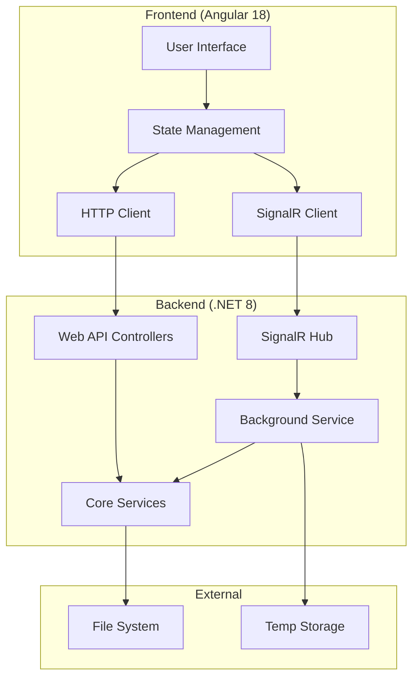
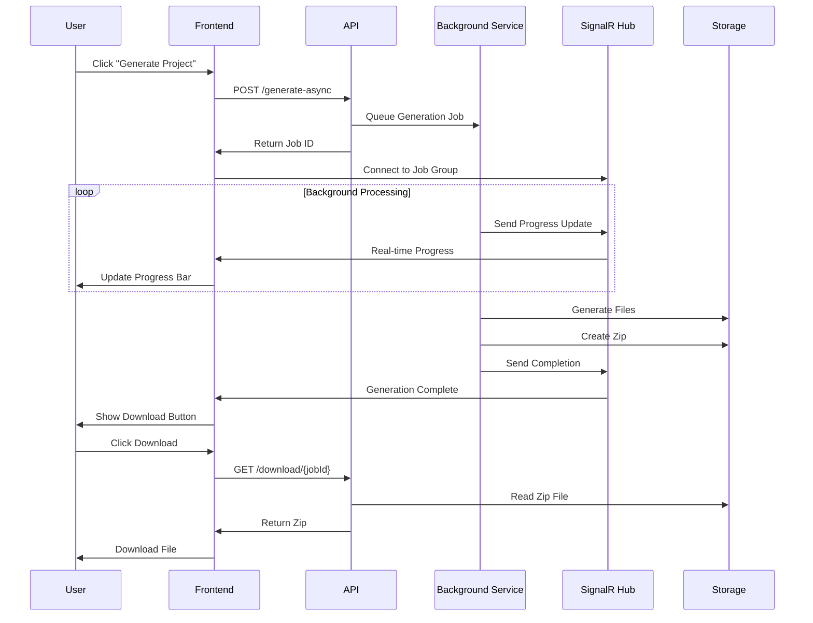
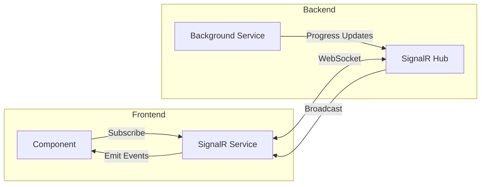

# System Architecture

## 🏗️ Overview

The Clean Architecture Template Generator follows a modern, scalable architecture with clear separation of concerns, real-time communication, and asynchronous processing capabilities.

## 🎯 Architecture Principles

### 1. **Clean Architecture**
- **Dependency Inversion**: High-level modules don't depend on low-level modules
- **Single Responsibility**: Each component has one reason to change
- **Open/Closed**: Open for extension, closed for modification
- **Interface Segregation**: Clients shouldn't depend on unused interfaces

### 2. **Separation of Concerns**
- **Frontend**: User interface and user experience
- **Backend**: Business logic and data processing
- **Communication**: Real-time updates via SignalR
- **Storage**: File system for templates and generated code

### 3. **Scalability**
- **Asynchronous processing** for long-running operations
- **Background job queue** for handling multiple requests
- **Stateless design** for horizontal scaling
- **Microservice-ready** architecture

## 🏛️ System Components



## 🔄 Data Flow

### 1. **Project Generation Flow**



### 2. **Real-time Communication**



## 🧩 Component Architecture

### Frontend Architecture

```
src/app/
├── components/                    # UI Components
│   ├── main-layout.component.*   # Main application layout
│   ├── panels/                   # Side panels
│   │   ├── entities-panel.*      # Entity management
│   │   ├── relationships-panel.* # Relationship management
│   │   └── project-panel.*       # Project settings
│   ├── dialogs/                  # Modal dialogs
│   │   └── generation-progress-dialog.* # Progress tracking
│   └── flowchart-canvas.*        # Visual design canvas
├── services/                     # Business Logic
│   ├── project-state.service.*   # State management
│   ├── project-generator.service.* # API communication
│   └── signalr.service.*         # Real-time communication
├── models/                       # Data Models
│   └── project.models.*          # TypeScript interfaces
└── styles/                       # Global Styles
    └── styles.scss               # Material Design customization
```

### Backend Architecture

```
src/backend/
├── CleanArchitectureTemplateGenerator/     # Web API Layer
│   ├── Controllers/              # API Controllers
│   │   └── ProjectGeneratorController.cs
│   ├── Hubs/                     # SignalR Hubs
│   │   └── GenerationProgressHub.cs
│   ├── Services/                 # Application Services
│   │   └── BackgroundGenerationService.cs
│   └── Program.cs                # Application startup
└── CleanArchitectureTemplateGenerator.Core/ # Core Layer
    ├── Models/                   # Domain Models
    │   ├── ProjectMetadata.cs
    │   ├── Entity.cs
    │   └── GenerationResult.cs
    └── Services/                 # Core Services
        ├── IProjectGeneratorService.cs
        ├── ProjectGeneratorService.cs
        ├── IZipService.cs
        └── ZipService.cs
```

## 🔌 Integration Patterns

### 1. **API Integration**
- **RESTful endpoints** for CRUD operations
- **Async/await patterns** for non-blocking operations
- **Error handling** with proper HTTP status codes
- **CORS configuration** for cross-origin requests

### 2. **Real-time Integration**
- **SignalR hubs** for bidirectional communication
- **Group-based messaging** for job-specific updates
- **Automatic reconnection** handling
- **Connection state management**

### 3. **Background Processing**
- **Hosted service** for background job processing
- **Concurrent queue** for job management
- **Progress tracking** with step-by-step updates
- **Error handling** and retry mechanisms

## 🛡️ Security Considerations

### 1. **Frontend Security**
- **Input validation** on all user inputs
- **XSS prevention** through Angular's built-in protection
- **CSRF protection** via Angular's HTTP interceptors
- **Secure communication** over HTTPS in production

### 2. **Backend Security**
- **Input sanitization** and validation
- **File path validation** to prevent directory traversal
- **Temporary file cleanup** to prevent storage leaks
- **Rate limiting** for API endpoints (future)

### 3. **Communication Security**
- **CORS policy** configuration
- **SignalR authentication** (future enhancement)
- **API key authentication** (future enhancement)
- **Request/response logging** for audit trails

## 📊 Performance Considerations

### 1. **Frontend Performance**
- **Lazy loading** of components
- **OnPush change detection** strategy
- **Virtual scrolling** for large lists
- **Optimized bundle size** with tree shaking

### 2. **Backend Performance**
- **Asynchronous processing** for I/O operations
- **Background job queue** to prevent blocking
- **Memory-efficient** file processing
- **Connection pooling** for database operations (future)

### 3. **Real-time Performance**
- **Efficient message serialization**
- **Group-based broadcasting** to reduce overhead
- **Connection management** with automatic cleanup
- **Backpressure handling** for high-frequency updates

## 🔄 Scalability Strategy

### 1. **Horizontal Scaling**
- **Stateless design** for easy scaling
- **Load balancer** support
- **Shared storage** for generated files
- **Redis backplane** for SignalR scaling (future)

### 2. **Vertical Scaling**
- **Efficient memory usage**
- **CPU-optimized** code generation
- **I/O optimization** for file operations
- **Garbage collection** tuning

### 3. **Microservice Transition**
- **Domain-driven design** boundaries
- **API gateway** integration ready
- **Service discovery** support
- **Distributed tracing** capabilities (future)

## 🔍 Monitoring and Observability

### 1. **Logging**
- **Structured logging** with Serilog (future)
- **Correlation IDs** for request tracking
- **Performance metrics** collection
- **Error tracking** and alerting

### 2. **Health Checks**
- **Application health** endpoints
- **Dependency health** monitoring
- **Custom health checks** for services
- **Health dashboard** integration

### 3. **Metrics**
- **Application metrics** (requests, errors, latency)
- **Business metrics** (generations, downloads)
- **Infrastructure metrics** (CPU, memory, disk)
- **Custom metrics** for specific scenarios

---

This architecture provides a solid foundation for a scalable, maintainable, and performant application while following modern development best practices.
